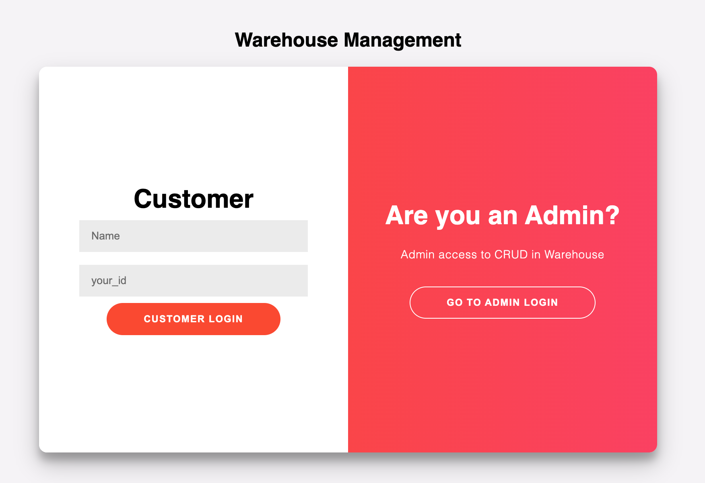
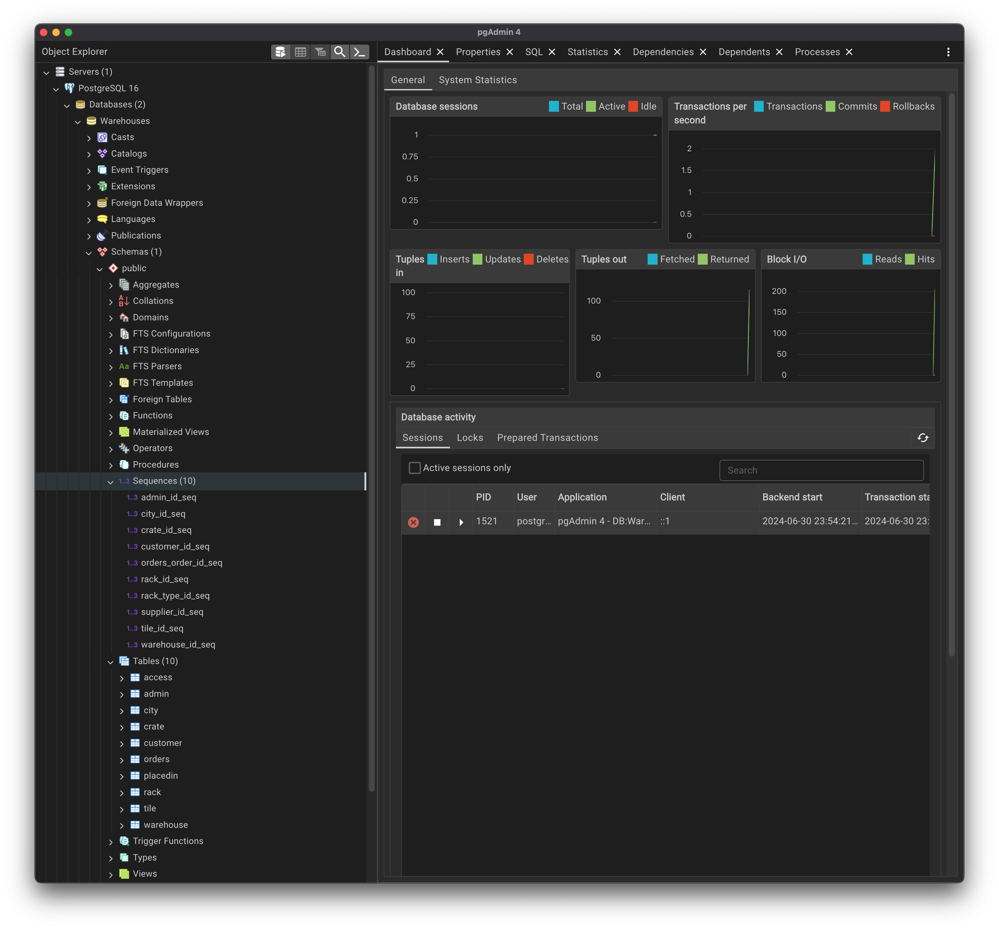
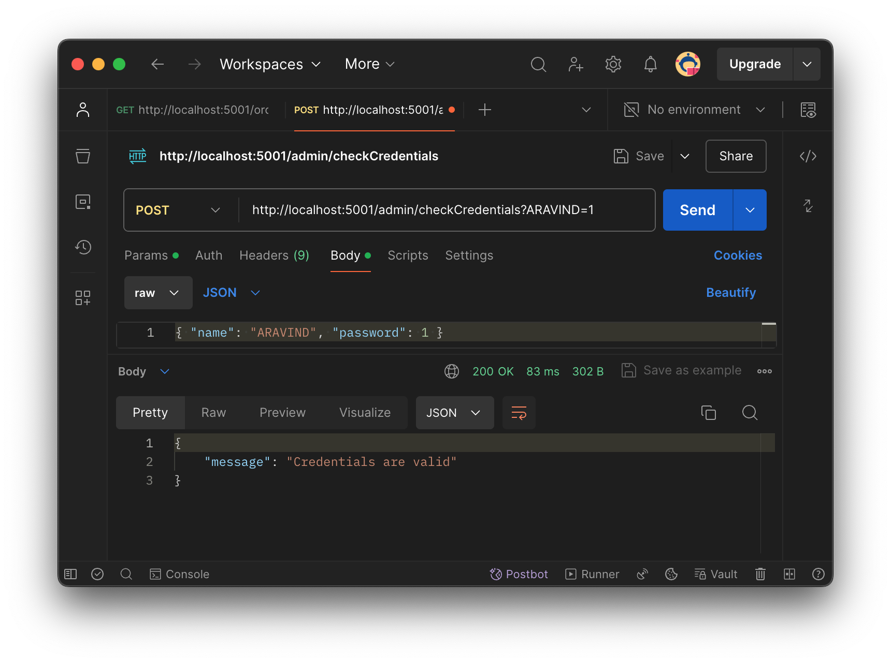

# Warehouse Management System 

  This project is a warehouse management application built with the PERN stack (PostgreSQL, Express.js, React, Node.js). It features a customer login for tracking individual orders and an admin login for managing and tracking all orders within the warehouse. The frontend is developed using React, while the backend is powered by Node.js with Express.js, and PostgreSQL is used for the database.

  The system includes two main user roles:

- **Customer**: Customers can log in to track their individual orders, providing them with real-time updates on their order status.
- **Admin**: Admins have access to a comprehensive dashboard to manage and track all orders within the warehouse, ensuring efficient handling and processing of goods.


## Technologies Used

  -	**Frontend**: [client](https://github.com/AravindXD/WMS_PERN-app/tree/main/client)
	-	**React**: A JavaScript library for building user interfaces, used for developing the customer and admin dashboards.
	-	**HTML/CSS**: Standard web technologies for structuring and styling the application.
    

  -	**Backend**: [server](https://github.com/AravindXD/WMS_PERN-app/tree/main/server)
	-	**Node.js**: A JavaScript runtime built on Chrome’s V8 JavaScript engine, used for server-side scripting.
	-	**Express.js**: A minimal and flexible Node.js web application framework, used for building the RESTful API.

  -	**Database**:	
	-	**PostgreSQL**: A powerful, open-source object-relational database system, used to store and manage data.
	-	**PGAdmin**: A web-based administration tool for managing PostgreSQL databases, used for database design, maintenance, and monitoring.
        

  -	**API Testing**:	
	-	**Postman**: A collaboration platform for API development, used for testing and documenting the API endpoints to ensure they work as expected.
        


## Installation 
Follow these steps to set up the project on your local machine

 1. ### Software and Packages Required
    - [PostgreSQL](https://www.postgresql.org/download/)
    - [Node.js](https://nodejs.org/en) -> create-react-app , express , cors
    - [Postman](https://www.postman.com/downloads/) **(optional)**

2. ### Clone the repository:
    ```sh
    git clone https://github.com/AravindXD/WMS_PERN-app
    ```

3. ### Database Creation
Use the [backup.sql](backup.sql) file to import the schema in PGAdmin. Change the data in the INSERT commands of sql file if needed. 
Refer to the below links if necessary: 
- [Pgadmin configuration on Mac](https://youtu.be/yOkRqeABEnE?si=xIE4sJ9OA4c1hiE4)
- [How to Import Database(.sql) in PostgreSql](https://youtu.be/3AKIA8pu8YY?si=J_4XqB05Mq6oc8ib)

>[!CAUTION]
> Make sure the credentials are changed accordingly in the [server/db.js](server/db.js)

4. ### Shell commands
```sh
cd WMS_PERN-app
npm install
```
- I would suggest two terminals for both the folders:
    - [client](https://github.com/AravindXD/WMS_PERN-app/tree/main/client)
    ```sh
        npm start
    ```
    The webpage will be live on http://localhost:3000

    - [server](https://github.com/AravindXD/WMS_PERN-app/tree/main/server)
    ```sh
        nodemon index
    ```
    The database server will start on port 5001

- To verify server init *(optional)* , you can check APIs with the Postman Application


## [LICENSE](LICENSE)

This project is licensed under the GNU General Public License v3.0. This license ensures that you have the freedom to use, modify, and distribute the software freely. By adhering to the terms of the GPL, any modifications you make and distribute must also be open source and licensed under the GPL.